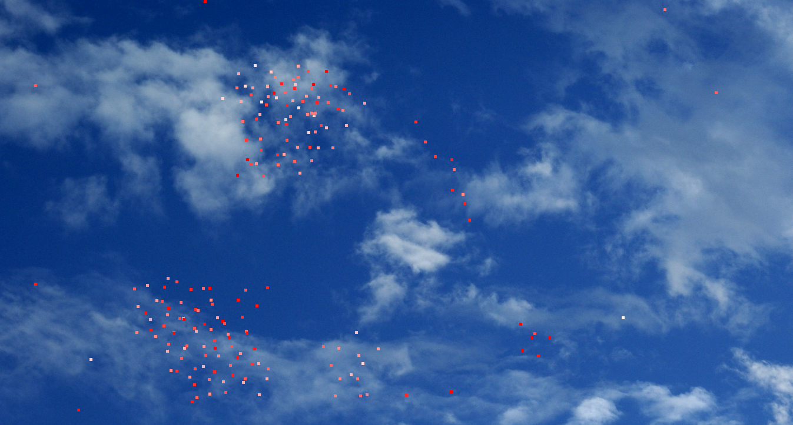

# What I learned:
* Working with vectors and forces
* Practicing Design by contract (Pre, Post, Inv comments)

# Task:
Simulate a bird swarm.
More info about the their behaivior and how they can be simulated in this paper: [Boids by Craig Reynolds](https://www.red3d.com/cwr/boids/index.html)

**Note: On this task I worked with two other colleges at the TU**

